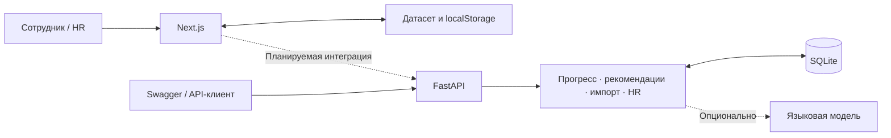

# ÖSU

**Платформа развития сотрудников для трека Halyk Bank.**

ÖSU связывает обучение с карьерной целью: показывает, каких навыков не хватает, предлагает до трёх полезных активностей и объясняет ожидаемый результат. После завершения активности прогресс пересчитывается, а HR получает общую картину развития команды.

Основной сценарий: **профиль → цель → дефицит навыков → рекомендация → действие → обновлённый прогресс**.

## Возможности

**Для сотрудника:** профиль, выбор и изменение карьерной цели, сравнение навыков с требованиями роли, объяснимые рекомендации, каталог активностей, запись и демо-завершение, история участия.

**Для HR:** дефициты компетенций команды, показатели участия, импорт проверочных профилей и истории. В интерфейсе также доступны готовность к выбранным целям и отсутствие завершений за последние 90 дней. Публичного рейтинга сотрудников нет.

**Интерфейс:** русский, английский и казахский языки, мобильная адаптация, сохранение состояния в браузере, зелёная палитра и короткое полноэкранное вступление. Анимацию можно пропустить; системная настройка уменьшения движения учитывается.

## Стек

| Часть    | Технологии                                                  |
| -------- | ----------------------------------------------------------- |
| Frontend | Next.js 16, React 19, TypeScript, CSS / Tailwind CSS 4, SVG |
| Backend  | Python 3.12+, FastAPI, Pydantic v2                          |
| Хранение | SQLAlchemy 2.x, SQLite                                      |
| LLM      | HTTPX, совместимый `/chat/completions` API                  |
| Проверки | Playwright, pytest, ESLint, Prettier, Ruff                  |
| Запуск   | npm, uv, Docker Compose для backend                         |

## Архитектура



**Frontend** разделён на экраны в `src/features/`, общие компоненты и доменные расчёты в `src/lib/`. Цель выбирает сотрудник; без цели интерфейс показывает развитие в текущей роли и грейде. Локальные изменения и язык сохраняются в `localStorage`.

**Backend** находится в `backend/app/`. Он загружает и проверяет данные, рассчитывает дефициты и рекомендации, формирует HR-сводки и сохраняет изменения в SQLite. Импорт и завершение выполняются транзакционно. Повтор завершения с тем же `completion_id` возвращает сохранённый ответ без повторного начисления навыков.

## Данные и модели

Все демонстрационные данные синтетические. Frontend использует исходный набор: **200 сотрудников, 40 активностей, 60 навыков, 32 профиля ролей и грейдов, 2 743 записи истории**. Дата среза — **1 октября 2026 года**.

Backend по умолчанию запускается на небольшом наборе из `backend/data/synthetic/`: **10 сотрудников, 8 активностей, 15 навыков, 8 профилей ролей и грейдов, 12 записей истории**. Его идентификаторы и результаты отличаются от браузерного демо.

| Модель          | Назначение                                                          |
| --------------- | ------------------------------------------------------------------- |
| Сотрудник       | Роль, грейд, стаж, навыки, карьерная цель и дата оценки             |
| Навык           | Справочник hard / soft skills; уровень от 0 до 5                    |
| Требования роли | Нужные уровни и критические навыки для конкретного грейда           |
| Активность      | Аудитория, формат, условия участия и прирост навыков                |
| История         | Участие, даты и статусы: завершение, пропуск, отказ и другие        |
| Завершение      | Серверный ключ действия и ответ для защиты от повторного начисления |

Типы UI описаны в [domain.ts](frontend/src/lib/domain.ts), контракты API — в [schemas.py](backend/app/schemas.py), таблицы базы — в [models.py](backend/app/models.py). В SQLite используются `employees`, `employee_skills`, `skills`, `grade_requirements`, `events`, `activity_history` и `completions`.

## Рекомендации, прогресс и AI

### Логика рекомендаций

Backend определяет следующий грейд текущей роли, рассчитывает разницу между нужными и текущими навыками и отбирает доступные активности. Обязательные, завершённые, неподходящие по аудитории или prerequisites мероприятия исключаются.

Оценка учитывает долю закрываемого дефицита, критичность навыков, адресность аудитории и пропуски / отказы по похожим активностям. В ответе доступны числовые факторы и объяснение. Если полезного шага нет или требования уже выполнены, сервер возвращает соответствующий статус вместо случайной рекомендации.

Frontend использует отдельный демо-алгоритм: ориентируется на выбранную цель, дополнительно учитывает длительность и будущие сессии. Правила двух контуров предстоит унифицировать. Полная серверная формула описана в [документации рекомендаций](backend/docs/recommendations.md).

### Рост навыков

```text
новый уровень = min(5, max(текущий, min(текущий + gain, max_level)))
```

Активность не снижает уже достигнутый уровень и не даёт прирост выше своего предела. Например, при уровне 2, `gain=2` и `max_level=3` результат равен 3.

Готовность в UI — доля набранных уровней относительно требований цели, с ограничением вклада каждого навыка его требованием. Backend возвращает дефициты следующего грейда и сумму недостающих уровней. Эти показатели не означают автоматического повышения.

Frontend учитывает исторические завершения после последней оценки навыков. Backend считает импортированные навыки текущим снимком и не начисляет историю повторно.

### Языковая модель

Собственная нейросеть не обучается. В backend реализован опциональный LLM-этап: модель получает до восьми рассчитанных кандидатов и выбирает от одного до трёх. Ответ проверяется по схеме, допустимым ID и точному содержанию предоставленных фактов; модель не может изменить навыки, баллы или каталог.

Без ключа, при ошибке или превышении тайм-аута в 8 секунд возвращается локальный результат с `source: fallback`. Проверенный ответ модели помечается `source: llm`. Во frontend LLM пока не подключена; автоматические тесты используют подмену HTTP-ответов, а не живого провайдера.

## Запуск

Команды выполняются из корня репозитория, если не указано иное. Для базовой демонстрации LLM-ключ не нужен.

### Frontend

Требуются Node.js 20.9+ и npm.

```sh
npm --prefix frontend ci
npm --prefix frontend run dev
```

Интерфейс dev-сервера: [http://localhost:5173](http://localhost:5173). Для production-сборки:

```sh
npm --prefix frontend run build
npm --prefix frontend start -- --port 3000
```

Основные API-экраны:

- `/me` — профиль, требования к следующему грейду, рекомендации и история;
- `/hr` — сводка дефицитов, сотрудников без шага и участия в активностях;
- `/hr/employees` — поиск сотрудников по ID и фильтр по роли;
- `/hr/employees/:id` — профиль сотрудника для HR;
- `/hr/import` — импорт JSON или файлов профилей и истории;
- `/demo` — прежнее автономное демо на локальных данных.

Роль «Сотрудник» или «HR» выбирается в шапке. В режиме HR откройте список
сотрудников и выберите профиль; затем выбранный ID можно показать в режиме
сотрудника. Это демонстрационный переключатель, доступ окончательно проверяет
backend. Под ролью employee HR-пункты скрыты, а прямой переход показывает
сообщение о недостаточном доступе.

`VITE_API_URL` задаёт базовый URL API вместе с `/api`; значение по умолчанию —
`/api`. Dev-сервер проксирует его на `http://localhost:8000`, production nginx —
на сервис `backend` в Compose. Секреты и `LLM_API_KEY` во frontend не передаются.

#### Сценарий демо на 5 минут

1. Выберите HR и на `/hr` покажите диаграмму проседающих навыков, две группы сотрудников без шага и участие в активностях.
2. Откройте `/hr/employees`, найдите сотрудника по ID, отфильтруйте роль и перейдите в профиль.
3. Покажите роль, грейд, стаж, требования, дефициты и объяснимую рекомендацию с бейджем AI или «Скоринг».
4. Нажмите «Выполнил»: покажите навыки до/после, ограничение `max_level`, оставшийся дефицит и обновлённый следующий шаг.
5. Откройте историю и импорт; покажите ошибку по конкретному полю, затем успешный импорт и ссылки на профили.
6. Переключитесь в «Сотрудник»: HR-навигация исчезнет, а прямой `/hr` покажет сообщение о доступе.

Проверены TypeScript, ESLint, OpenAPI-типы, unit-тесты и production-сборка.
Playwright покрывает роли, маршруты, завершение, импорт и мобильный viewport с
mock API, однако полный браузерный прогон в текущем окружении заблокирован
отсутствующей системной `libnspr4.so`. Реальные LLM-вызовы, production-аутентификация
и развёртывание за внешним TLS не проверялись.

### Backend

Требуются Python 3.12+ и uv. В отдельном терминале:

```sh
cd backend
uv sync --locked
uv run uvicorn app.main:app --host 127.0.0.1 --port 8000
```

Swagger: [http://127.0.0.1:8000/docs](http://127.0.0.1:8000/docs). При старте создаётся SQLite-база; повторный запуск сохраняет существующие данные.

Основные настройки: `DATA_DIR`, `DATABASE_URL`, `LLM_API_KEY`, `LLM_BASE_URL`, `LLM_MODEL`. Для загрузки `.env` используйте `uv run --env-file .env uvicorn app.main:app`. Проверьте модель в файле: пример конфигурации переопределяет значение по умолчанию из кода. Подробности — в [backend README](backend/README.md).

Для исходного набора задания запустите из `backend/` с отдельной базой:

```sh
DATA_DIR=../dataset/case_1/career_quest_dataset \
DATABASE_URL=sqlite:///./osu-organizer.db \
uv run uvicorn app.main:app --host 127.0.0.1 --port 8000
```

### Запуск всего проекта через Docker

Потребуется запущенный **Docker Engine или Docker Desktop**. Локальная установка Node.js, Python и uv для этого варианта не нужна. Все команды выполняются из корня репозитория; первая сборка требует доступа к интернету.

**1. Соберите два образа из корневого Dockerfile:**

```sh
docker build --target backend -t osu-backend .
docker build --target frontend -t osu-frontend .
```

**2. Запустите backend и frontend:**

```sh
docker run -d --name osu-backend --restart unless-stopped \
  -p 127.0.0.1:8000:8000 \
  -v osu-data:/var/lib/career-quest \
  osu-backend

docker run -d --name osu-frontend --restart unless-stopped \
  -p 127.0.0.1:3000:3000 \
  osu-frontend
```

**3. Откройте приложение:**

| Сервис        | Адрес                                                                    |
| ------------- | ------------------------------------------------------------------------ |
| Интерфейс ÖSU | [http://localhost:3000](http://localhost:3000)                           |
| Swagger API   | [http://localhost:8000/docs](http://localhost:8000/docs)                 |
| OpenAPI       | [http://localhost:8000/openapi.json](http://localhost:8000/openapi.json) |

Backend при первом запуске загружает небольшой синтетический набор и сохраняет SQLite в томе `osu-data`. Frontend использует собственный демо-набор; запуск двух контейнеров сам по себе не подключает интерфейс к API. Без LLM-ключа сервер возвращает локальные рекомендации.

**Управление контейнерами:**

```sh
# Состояние и логи; Ctrl+C завершает просмотр логов, а не контейнер.
docker ps -a --filter name=osu-
docker logs -f osu-backend
docker logs -f osu-frontend

# Остановка и повторный запуск без пересоздания.
docker stop osu-frontend osu-backend
docker start osu-backend osu-frontend

# Удаление контейнеров для последующей пересборки.
docker rm -f osu-frontend osu-backend
```

Удаление контейнеров не удаляет том `osu-data`. Для обновления кода пересоберите образы и заново выполните команды `docker run` после удаления старых контейнеров. Если порты `3000` или `8000` заняты локальными серверами, сначала остановите их. Ошибка подключения к Docker daemon означает, что нужно запустить Docker Engine / Desktop.

**Запуск frontend и backend через Compose**

```sh
docker compose up --build -d
docker compose ps
docker compose logs -f frontend backend
```

Compose использует `frontend/Dockerfile` и `backend/Dockerfile`, открывает интерфейс
на порту `3000`, API на `8000` и хранит SQLite в томе `career_quest_db`. Nginx
отдаёт SPA с fallback на `index.html` и проксирует `/api` в сервис `backend`.
Для остановки выполните `docker compose down`; без `-v` база сохраняется.

Compose передаёт `LLM_API_KEY` из окружения или корневого `.env`; остальные настройки контейнеров заданы в `docker-compose.yml`.

## API и импорт

Все `/api`-запросы требуют `X-Role: employee|hr` и `X-Employee-Id`. Сотрудник обращается только к своему профилю; HR — ко всем профилям и HR-маршрутам. Это доверенные заголовки для разработки, а не полноценная аутентификация.

| Метод  | Маршрут                               | Назначение                          |
| ------ | ------------------------------------- | ----------------------------------- |
| `GET`  | `/api/employees/{id}`                 | Профиль, прогресс и история         |
| `GET`  | `/api/employees/{id}/recommendations` | Рекомендации, факторы и дефициты    |
| `POST` | `/api/employees/{id}/complete`        | Завершение и обновление навыков     |
| `GET`  | `/api/employees`                      | HR-список сотрудников               |
| `GET`  | `/api/hr/summary`                     | Командные дефициты и участие        |
| `POST` | `/api/import`                         | Атомарный импорт профилей и истории |

Пример для стандартного серверного набора:

```sh
curl http://127.0.0.1:8000/api/employees/SYN_E001/recommendations \
  -H 'X-Role: employee' -H 'X-Employee-Id: SYN_E001'
```

Импорт принимает JSON с массивами `employees` и `history` либо multipart-файлы `employees_file` и `history_file` (CSV / JSON для истории). Проверяются схемы, ссылки и дубликаты; ошибка откатывает весь пакет. Профиль с существующим ID заменяется целиком. Идентификаторы навыков и мероприятий должны соответствовать загруженному каталогу.

Готовые материалы: [три проверочных профиля](backend/docs/import-example.json), [правила импорта](backend/docs/hr.md), [примеры API](backend/docs/examples.md), [OpenAPI](backend/docs/openapi.json).

## Демонстрация для жюри

1. Выберите профиль, откройте траекторию и задайте карьерную цель.
2. Покажите дефицит навыка и объяснение подходящей рекомендации.
3. Запишитесь на доступную активность, отметьте демо-завершение и сравните прогресс.
4. Переключите язык и обновите страницу — состояние сохранится.
5. Выберите «Демо-роль → HR», покажите аналитику и импорт проверочных данных.
6. Отдельно в Swagger проверьте рекомендации и завершение. Повторите запрос с тем же `completion_id`: повторного прироста не будет.

## Тестирование

Frontend — из `frontend/`:

```sh
npm run lint
npm run format:check
npm run build
npx playwright install chromium
npm test
```

Backend — из `backend/`:

```sh
uv run pytest -q
uv run ruff check app scripts tests
uv run ruff format --check app scripts tests
```

В проекте **33 frontend-теста** и **113 backend-тестов**: расчёты, пользовательские сценарии, локализация, мобильный вид, импорт, доступ, LLM-fallback, повторные и конкурентные завершения. Есть проверка импорта трёх профилей и трёх fallback-рекомендаций менее чем за две секунды; это локальная регрессионная проверка, не нагрузочный SLA.

## Структура проекта

```text
frontend/
  src/app/              # Страница, метаданные и стили
  src/components/       # Оболочка, вступление и UI-примитивы
  src/features/         # Сотрудник, каталог, история, HR, импорт
  src/lib/              # Модели, расчёты, валидация и переводы
  tests/                # Playwright
backend/
  app/                  # FastAPI, модели и доменная логика
  data/synthetic/       # Серверный демо-набор
  docs/                 # Контракты и примеры
  tests/                # pytest
  Dockerfile
  pyproject.toml
dataset/case_1/          # Исходные данные задания
docker-compose.yml      # Запуск backend
```
